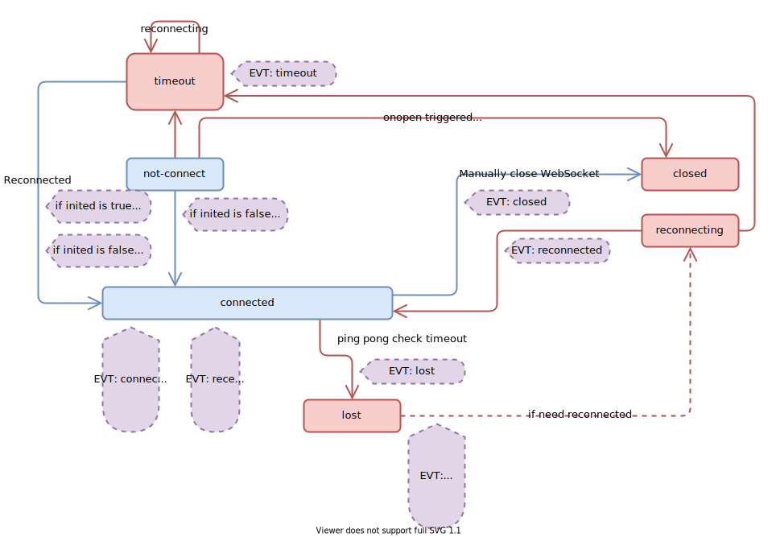

# ws-frame
`ws-frame` was used for one of my private project, and I make it as a library which is an utility for `WebSocket`. It could make your `WebSocket` more smartly because it could be reconnect to the server automatically. 

<a href="./doc/tutorial_zh-cn.md">中文版使用说明</a>


## Get started


### Install ws-frame

First, you need to install the package into your project.

```bash
npm install ws-frame
yarn add ws-frame	
```

* **Be attention: This library is written under the gramma of ES Module. You could use it in your `@vue/cli`, `create-react-app` generated projects and `webpack` projects.**
* **But it is not suitable for browser or `Node.js` development. You could download the source code from github and do some changes to meet your requirements.**


### Import ws-frame

Add the below codes into your `.js` file which would use this library.

```javascript
import wsframe from "ws-frame";
```


### Construct a wsframe object

Create a `WebSocket` connection managed by `wsframe`.

```javascript
var wsc = new wsframe({
    server: "ws://127.0.0.1:6099/test"
});
```

You could create a `WebSocket` connection by `new wsframe(options)`, and the `options` is a javascript object could contains below members.


**If there is a * symbol after the name of the field means this field is required.**

| field              | type     | default               | descript                                                     |
| ------------------ | -------- | --------------------- | ------------------------------------------------------------ |
| server *           | string   | -                     | The url of the server you need to connect to.<br />For example:  `ws://127.0.0.1:6099/test` |
| debugLog           | bool     | false                 | Output the log of each stage switching.<br /><br />Only for debug, it should be always `false`. |
| connectTimeout     | number   | 5000                  | The max time between the `wsframe.open` called and the connection is successfully connected.<br />If time is over, the connection would be closed and try to reconnect if `reconnect` is set to `true`.<br />Unit: ms |
| reconnect          | bool     | true                  | While `lost` or `timeout`, should `wsframe` automatically reconnect to the server. |
| reconnectDelay     | number   | 5000                  | How long would wait before `wsframe` reconnect to the server.<br />Unit: ms |
| sendPing           | bool     | true                  | If `true`, send a heart-beat to the server looply.           |
| sendPingPeriod     | number   | 29999                 | If `sendPing` is true, how long would be wait between each heart-beat sending. |
| pingPongTimeout    | number   | 10000                 | If `sendPing` is true, the max time between the heart-beat sent and the server responses the heart-beat.<br />If time is over, the connection would be closed and try to reconnect if `reconnect` is set to `true`.<br />Unit: ms |
| generatePingPack   | function | `() => 'ping'`        | The function used to generate the heart-beat package.<br />The return value is the message set to the server. |
| isPongChecking     | function | `(msg)=>msg==='pong'` | The function used for checking the heart-beat is responded correctly.<br />If return `true`, the server responded correctly. |
| pongNotFireReceive | bool     | `true`                | After the heart-beat checking completed, would the checked message still trigger the `received` event. |


### Bind the events

```javascript
wsc.on("<event name>", callback);

function callback(evt){ ... }
```

`<event name>` could be:

| event name       | description                                                  |
| ---------------- | ------------------------------------------------------------ |
| lost             | When <u>1.the connection is closed accidently</u>, or 2.<u>determined as timeout via `ping-pong` timeout checking</u>. <br />The connection would be closed and this event would be triggered.<br /><br />The parameters of function `callback(evt)`：<br />`evt.wsc`: The original managed `WebSocket` Instance. |
| inited           | When 1.<u>The first time connected to the server</u>, or 2.<u>closed manually then reconnect to the server</u>,<br />This event would be triggered.<br /><br />The parameters of function `callback(evt)`：<br />`evt.wsc`: The original managed `WebSocket` Instance. |
| reconnected      | If the connection is lost, usually after the `lost` event is triggered.<br />And then reconnected to the server.<br />This event would be triggered.<br /><br />The parameters of function `callback(evt)`：<br />`evt.wsc`: The original managed `WebSocket` Instance.<br />`evt.server`: the url of the remote server. |
| connected        | After `inited` or `reconnected` is triggered, this event would be always triggered after them.<br />If you need to do something on after what ever the connection is connected, use this.<br /><br />The parameters of function `callback(evt)`：<br />`evt.wsc`: The original managed `WebSocket` Instance.<br />`evt.server`: the url of the remote server. |
| timeout          | When the max time is over after the connection is open, and the connection is not successfully connected. This event would be triggered.<br />The parameters of function `callback(evt)`：<br />`evt.wsc`: The original managed `WebSocket` Instance.<br />`evt.server`: the url of the remote server. |
| closed           | Only would be triggered, after calling `wsframe.close()`to close the connection manually.<br /><br />The parameters of function `callback(evt)`：<br />`evt.wsc`: The original managed `WebSocket` Instance. |
| try-to-reconnect | Before `wsframe` try to reconnect to the server, this event would be triggered.<br />Usually after the `lost` event and `timeout` event.<br /><br />The parameters of function `callback(evt)`：<br />`evt.wsc`: The original managed `WebSocket` Instance.<br />`evt.delay` How long would be delayed to try to reconnect. |
| received         | While the message from the server is received.<br /><br />The parameters of function `callback(evt)`：<br />`evt.wsc`: The original managed `WebSocket` Instance.<br />`evt.payload`: The received data, could be `string` or `ArrayBuffer`. |


### Some usable properties

```javascript
wsc.$props.onlineState // => "offline" or "online"
```

You could read some information about the currently using `wsframe` object from `wsframe.$props`.

| field        | type                                                         | description                                                  |
| ------------ | ------------------------------------------------------------ | ------------------------------------------------------------ |
| connectState | "lost" \| "closed" \| <br />"timeout" \| "connected" \| <br />"not-connect" \| "reconnecting" | The state of the current connection. It could be:<br />lost - Closed accidently.<br />closed - Manually closed.<br />timeout - Connect timeout.<br />connected - Connected.<br />not-connect - Finished initializing but not start to connect.<br />reconnecting - Reconnecting. |
| onlineState  | "online" \| "offline"                                        | The state of the current server.<br />online - Online<br />offline - Offline |
| lastPingTime | Date                                                         | The last `ping` sent time, but would clear after each start of the connection. |
| lastPongTime | Date                                                         | The last heart-beat response received time, but would clear after each start of the connection. |
| inited       | bool                                                         | Is initialization is completed.<br /><br />Startup: `false`<br />After connected to the server: `true`<br /><br />Manually closed: `false`.<br />If the connection closed accidently, it would not be changed. |


### The diagram



