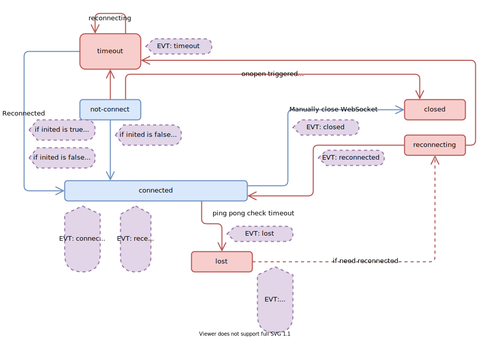

# ws-frame 使用说明

`ws-frame` 其实就是把之前我自己写了一个可以自动处理重连的`WebSocket`操作流程单独提取出来的一个库。当然，目前还在开发测试阶段，可能不太稳定就是。


## 文件结构

* `doc` - 这个项目的文档。

* `test` - 一个用于测试的项目。

  * `test/TestWebSocketServer` - 一个使用.NET 5.0开发的控制台应用程序。
  * `test/WebSocketTest` - 一个基于webpack的前端项目，用于启动一个测试的客户端。

  如何使用测试项目：

  1. 打开`test/TestWebSocketServer`中项目并运行。
  2. 使用一个命令行打开文件夹`test/WebSocketTest`，然后运行`yarn dev`。
  3. 打开浏览器，并打开页面`http://localhost:3300?uid={n}`，`{n}`可以是`1`,`2`,`3`。
  4. 测试`request-response`：在页面中的文本框中输入一些文本，然后点击`submit`按钮。然后下面的表格里面就会出现`200`和`you said: <你刚刚输入的文本>`。
  5. 测试 `server-push`：当你打开这个页面之后，web-socket会自动连接到服务器然后开始接受服务器传输过来的信息。没经过一段时间，服务器会主动发送`The current time is: <the time>`到所有的客户端。

## 开始使用

### 安装 ws-frame

首先你可能需要在你的项目中执行

```bash
npm install ws-frame
yarn add ws-frame
```

将`ws-frame`加入到你的项目中。

**※ 需要注意的是，这个库目前是使用ES Module的写法，可能你只能在 `@vue/cli` `create-react-app` 生成的项目中使用，或者用于`webpack`打包的项目。**

**※ 目前暂时可能不适合直接用于浏览器的引入和`Node.js`开发，不过你可以考虑使用 github 上的源码进行加工，以实现你自己的需求。**


### 引入 ws-frame

在你需要引入这个库的js文件中，添加

```javascript
import wsframe from "ws-frame";
```


### 新建 wsframe 对象

新建一个`wsframe`托管的`WebSocket`连接。

```javascript
var wsc = new wsframe({
    server: "ws://127.0.0.1:6099/test"
});
```

使用`new wsframe(options)`就可以创建一个连接，对于`options`可以的值包括了：

带有 * 标记的为必填项目

| field              | type     | default               | descript                                                     |
| ------------------ | -------- | --------------------- | ------------------------------------------------------------ |
| server *           | string   | -                     | 需要连接的目标服务器的URL地址。<br />例： `ws://127.0.0.1:6099/test` |
| debugLog           | bool     | false                 | 是否需要输出阶段切换的日志。<br />如果不是需要测试的话，这个选项不需要设定。<br />保持默认的`false`即可。 |
| connectTimeout     | number   | 5000                  | 当`wsframe.open`调用之后，经过多久没有连接到服务器则判定为超时。<br />单位：毫秒 |
| reconnect          | bool     | true                  | 当**超时/失去连接**发生时，是否自动重新连接。                |
| reconnectDelay     | number   | 5000                  | 当**超时/失去连接**发生时，经过多长时间自动重新连接。<br />单位：毫秒 |
| sendPing           | bool     | true                  | 是否发送心跳包确认服务器连接是否正常。                       |
| sendPingPeriod     | number   | 29999                 | 每次发送心跳包的间隔时间。<br />单位：毫秒                   |
| pingPongTimeout    | number   | 10000                 | 发送ping之后，多久没有收到pong视为断开连接。<br />单位：毫秒 |
| generatePingPack   | function | `() => 'ping'`        | 创建心跳包的方法，返回值为发送给服务器的心跳包的中的内容。   |
| isPongChecking     | function | `(msg)=>msg==='pong'` | 判断`msg`是否为心跳包的正确返回。<br />返回值为`bool`，指定返回是否有效。<br /> |
| pongNotFireReceive | bool     | `true`                | 心跳返回包在判断之后是否作为普通包触发`received`事件。       |


### 绑定事件

```javascript
wsc.on("<event name>", callback);

function callback(evt){ ... }
```

`<event name>`可以包括：

| event name       | description                                                  |
| ---------------- | ------------------------------------------------------------ |
| lost             | 当①<u>连接意外中断的时候</u>，或者②<u>通过`ping-pong`时间差判定延时过长时</u>，<br />会断开与服务器的连接，并触发该事件。<br /><br />`callback(evt)`中`evt`的成员：<br />`evt.wsc`： 代理中的`WebSocket`对象的实例。 |
| inited           | 当①<u>第一次与服务器建立连接</u>，或者②<u>手动关闭之后再度重新连接</u>时，<br />会触发该事件。<br /><br />`callback(evt)`中`evt`的成员：<br />`evt.wsc`： 代理中的`WebSocket`对象的实例。<br />`evt.server`： 远端地址。 |
| reconnected      | 当连接丢失（`lost`事件的后续）之后，重新建立连接时，<br />会触发该事件。<br /><br />`callback(evt)`中`evt`的成员：<br />`evt.wsc`： 代理中的`WebSocket`对象的实例。<br />`evt.server`： 远端地址。 |
| connected        | 在`inited`与`reconnected`之后，都会触发该事件。<br />即：只要与服务器建立连接都会触发该事件。<br /><br />`callback(evt)`中`evt`的成员：<br />`evt.wsc`： 代理中的`WebSocket`对象的实例。<br />`evt.server`： 远端地址。 |
| timeout          | 任何情况下，打开连接之后，经过指定时间之后，依旧没有与服务器<br />建立连接的情况下，会触发该事件。<br /><br />`callback(evt)`中`evt`的成员：<br />`evt.wsc`： 代理中的`WebSocket`对象的实例。<br />`evt.server`： 远端地址。 |
| closed           | 调用`wsframe.close()`方法手动关闭连接的时候触发。<br /><br />`callback(evt)`中`evt`的成员：<br />`evt.wsc`： 代理中的`WebSocket`对象的实例。 |
| try-to-reconnect | 非手动方式关闭连接，而连接断开时，都会触发这个事件。<br />这个事件通常跟在`lost`和`timeout`之后。<br /><br />`callback(evt)`中`evt`的成员：<br />`evt.wsc`： 代理中的`WebSocket`对象的实例。<br />`evt.delay`：经过多长时间进行再次连接的尝试。（单位：毫秒） |
| received         | 当接收到来自服务器的消息时触发。<br /><br />`callback(evt)`中`evt`的成员：<br />`evt.wsc`： 代理中的`WebSocket`对象的实例。<br />`evt.payload`： 收到的消息，可能是`ArrayBuffer`也可能是`string`。 |


### 可以用的一些属性

```javascript
wsc.$props.onlineState // => "offline" or "online"
```

可以从`wsframe.$props`中获取到当前`wsframe`对象的一些信息。

| field        | type                                                         | description                                                  |
| ------------ | ------------------------------------------------------------ | ------------------------------------------------------------ |
| connectState | "lost" \| "closed" \| <br />"timeout" \| "connected" \| <br />"not-connect" \| "reconnecting" | 当前连接的状态，目前有6种不同的情况。分别是：<br />lost - 非正常失去连接。（可能是心跳验证超时，或者意外断开连接）<br />closed - 正常关闭连接。<br />timeout - 连接时超时。<br />connected - 正常连接中。<br />not-connect - 初始化完毕，未进行连接的状态。<br />reconnecting - 超时/断开后自动重连。 |
| onlineState  | "online" \| "offline"                                        | 当前服务是否在线。<br />online - 在线<br />offline - 离线    |
| lastPingTime | Date                                                         | 上一次发送 ping 的时间，每次开始连接时会被清除。             |
| lastPongTime | Date                                                         | 上一次发送 ping 之后接收到服务器返回的时间。<br />每次开始连接时，会被清除。 |
| inited       | bool                                                         | 是否初始化完成。<br /><br />起始状态为`false`。<br />当连接上服务器之后会转为`true`。<br /><br />仅当正常关闭连接之后会转为`false`。 |


### 状态图以及事件触发时间点



